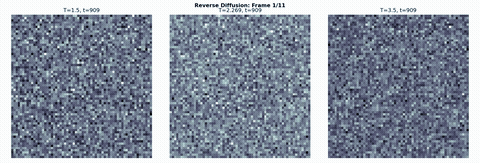
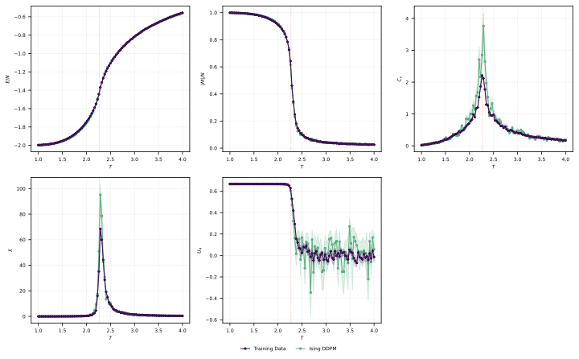
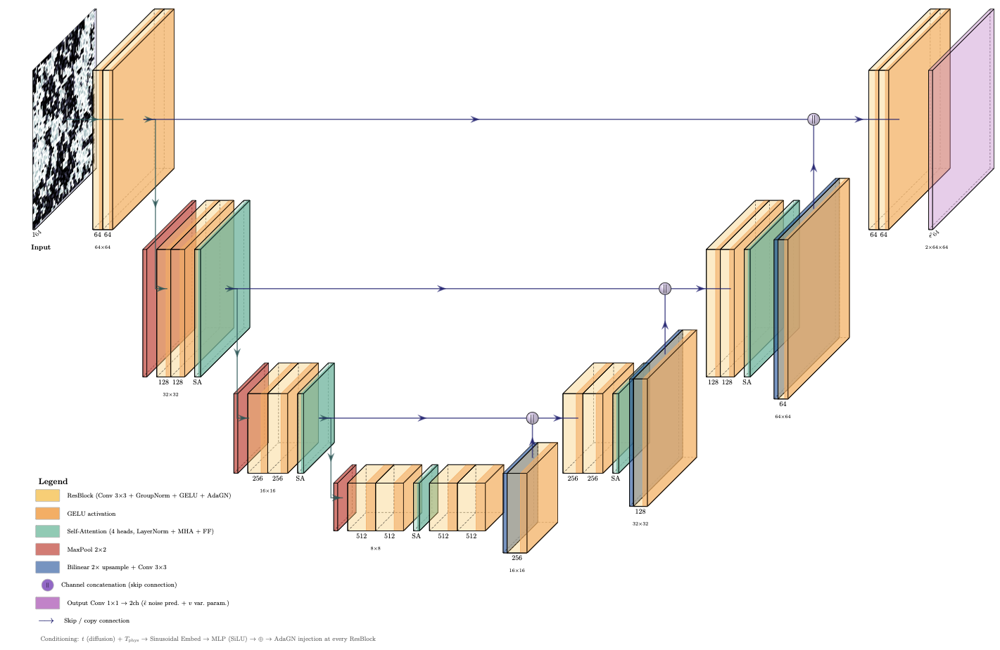
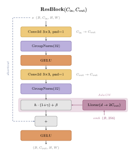
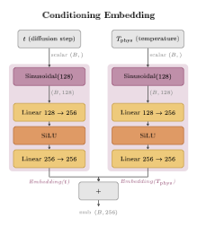
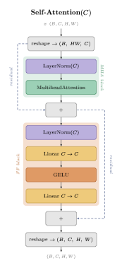

# Ising Diffusion 2D

**A temperature-conditioned denoising diffusion model that learns the complete phase diagram of the 2D Ising ferromagnet — from ordered domains through critical fractal clusters to paramagnetic noise — in a single neural network.**

<p align="center">
  
  <br>
  <em>Reverse diffusion: pure Gaussian noise is iteratively denoised into a physically valid spin configuration conditioned on temperature.</em>
</p>

---

## Why this project?

Monte Carlo simulation of the 2D Ising model near its critical point $T_c \approx 2.269$ suffers from *critical slowing down* — the autocorrelation time diverges as $\tau \sim \xi^z$ with dynamic exponent $z \approx 2$ for local (Metropolis) updates. Advanced cluster algorithms like Swendsen–Wang reduce this to $z \approx 0.3$, but the samples are still produced one at a time.

This project takes a different approach: **train a conditional generative model once, then sample arbitrary temperatures in parallel at inference time.** The diffusion model learns a single continuous mapping from $(T, \,\varepsilon) \to s$ (temperature and noise to spin configuration) that correctly reproduces:

- **Thermodynamic observables** — energy $E$, magnetization $|M|$, specific heat $C_v$, susceptibility $\chi$
- **The Binder cumulant** $U_4 = 1 - \langle m^4 \rangle / 3\langle m^2 \rangle^2$ — a finite-size scaling diagnostic for $T_c$
- **Spatial correlations** $G(r)$ and the correlation length $\xi$ via FFT
- **Smooth interpolation** to temperatures never seen during training

---

## Results

### Thermodynamic observables: Model vs Monte Carlo

Generated configurations are binarized ($\text{sign}(x_0)$) and their ensemble statistics are compared against exact Swendsen–Wang Monte Carlo data across the full temperature range. Error bars are computed via bootstrap resampling.

<p align="center">
  
</p>

### Key Findings & Summary of Results
- **First-Moment Fidelity**: Near-perfect agreement in energy per spin ($E/N$) and absolute magnetization per spin ($|M|/N$) across the full temperature range $T \in [1.0, 4.0]$.
- **Critical Exponent $\eta$**: At the phase transition ($T_c \approx 2.269$), fitting the spatial correlation decay $G(r) \propto r^{-\eta}$ yields a critical exponent of $\eta_{100} = 0.151 \pm 0.018$, compatible with the exact 2D Ising exponent ($\eta = 0.25$) within $1.5\sigma$.
- **Generalization to Unseen States**: The model successfully interpolates to unobserved temperatures during training with no systematic performance penalty ($\text{MSE}_{\text{unseen}} / \text{MSE}_{\text{seen}} \approx 1.0$).
- **Decisive Sampling**: Continuous-to-discrete binarization errors are negligible (1–2 ambiguous "gray-zone" sites per 64×64 lattice), with stochastic respaced sampling generating more binarization-stable states than deterministic DDIM at equal steps.

> For the detailed mathematical proofs, training dynamics, binarization analysis, and full validation, see the accompanying [Report.pdf](Report.pdf).

---

## Architecture

The model is a **conditional UNet** with ~17.4M parameters. Physical temperature $T$ and diffusion timestep $t$ are independently embedded via sinusoidal projections, summed, and injected into every residual block through **Adaptive Group Normalization** (AdaGN) — the conditioning signal dynamically scales and shifts feature maps rather than being concatenated to the input.

Spatial **self-attention** layers at 16×16 and 8×8 resolutions capture the long-range correlations that dominate near criticality. The model predicts both the noise mean $\varepsilon_\theta$ and a variance interpolation parameter $v_\theta$ (for optional VLB training), outputting 2 channels from a 1-channel input.

### Architecture Diagrams

**UNet global structure:**
<p align="center">
  
</p>

**Detailed sub-module implementations:**
<p align="center">
  
  
  
</p>

---

## Repository structure

```
├── src/
│   ├── mc/                     # Monte Carlo simulation
│   │   ├── ising_model.py      #   Metropolis & Swendsen–Wang (Numba JIT)
│   │   └── generate_data.py    #   Training data generation script
│   ├── dataset.py              # PyTorch Dataset with D₄ × Z₂ symmetry augmentations
│   ├── model.py                # UNet-S: ResBlock, AdaGN, SelfAttention, SinusoidalEmbedding
│   ├── diffusion.py            # Forward/reverse diffusion: DDPM, DDIM, Respaced sampling
│   ├── train.py                # Training loop: mixed-precision, EMA, early stopping
│   ├── sample.py               # Batched inference across temperature grids
│   └── evaluate.py             # Thermodynamic observables & comparison plots
├── train.py                    # CLI entrypoint → src.train
├── sample.py                   # CLI entrypoint → src.sample
├── evaluate.py                 # CLI entrypoint → src.evaluate
├── Ising_Diffusion.ipynb       # Interactive showcase notebook
├── data/
│   └── ising_benchmark.npz     # Lightweight MC benchmark (15 temps × 200 configs, 1.1 MB)
├── checkpoints/
│   ├── Ising_DDPM_1_E100_ema_only.pt   # Pre-trained EMA weights (66 MB)
│   └── Ising_DDPM_2_E80_ema_only.pt
├── figures/                    # Publication-quality plots
├── Report.pdf                  # Full scientific report
└── requirements.txt
```

---

## Physics-informed design choices

| Design decision | Motivation |
|---|---|
| **$D_4 \times \mathbb{Z}_2$ augmentations** | The Ising Hamiltonian on a square lattice is invariant under the dihedral group $D_4$ (rotations + reflections) and global spin inversion $s_i \to -s_i$. Augmenting with these symmetries reduces the effective dataset size needed by 16×. |
| **Cosine noise schedule** | Allocates more denoising capacity to intermediate noise levels where the model must resolve domain boundaries — the physically interesting structure. |
| **Adaptive Group Normalization** | Feature-space conditioning (scale + shift per channel) is more expressive than input concatenation for continuous conditioning variables like temperature. |
| **Self-attention at bottleneck** | Near $T_c$, the correlation length $\xi$ diverges — domain structures span the entire lattice. Self-attention at coarse resolutions captures these global correlations that convolutions alone cannot. |
| **EMA weights** | The exponential moving average of training weights produces smoother, more stable generated configurations with better thermodynamic statistics. |

---

## Getting started

### Installation

```bash
git clone https://github.com/<your-username>/ising-diffusion-2d.git
cd ising-diffusion-2d
pip install -r requirements.txt
```

### Interactive notebook

The fastest way to see the model in action:

```bash
jupyter notebook Ising_Diffusion.ipynb
```

### Command line

**Generate Monte Carlo training data** (Swendsen–Wang):
```bash
python -m src.mc.generate_data --n-samples 2000 --n-temps 51 --L 64
```

**Train** the diffusion model:
```bash
python train.py --data src/data/ising_data_51T_2000configs.npz --epochs 50 --batch-size 128 --schedule cosine --use-ema
```

**Sample** configurations at specific temperatures:
```bash
python sample.py --checkpoint checkpoints/Ising_DDPM_1_E100_ema_only.pt \
    --temperatures 1.0 2.269 4.0 --n-samples 200 --sampler ddim --n-steps 100
```

**Evaluate** against Monte Carlo ground truth:
```bash
python evaluate.py --samples samples/generated_samples_*.npz \
    --mc-data data/ising_benchmark.npz --binarization sign
```

---

## Requirements

- Python ≥ 3.9
- PyTorch ≥ 2.0
- NumPy, Matplotlib, tqdm
- Numba (for Monte Carlo simulation only)
- Jupyter (for the notebook)

---

## References

- **[1]** Brian H. Lee, Kat Nykiel, Ava E. Hallberg, Brice Rider, and Alejandro Strachan. "Thermodynamic fidelity of generative models for ising system". *The Journal of Chemical Physics*, 2025. doi: [10.1063/5.0251876](https://doi.org/10.1063/5.0251876).
- **[2]** Jonathan Ho, Ajay Jain, and Pieter Abbeel. "Denoising diffusion probabilistic models". *Advances in Neural Information Processing Systems*, 33, 2020. doi: [10.48550/arXiv.2006.11239](https://doi.org/10.48550/arXiv.2006.11239).
- **[3]** Alex Nichol and Prafulla Dhariwal. "Improved denoising diffusion probabilistic models". *Proceedings of the 38th International Conference on Machine Learning*, 2021. doi: [10.48550/arXiv.2102.09672](https://doi.org/10.48550/arXiv.2102.09672).
- **[4]** Prafulla Dhariwal and Alexander Quinn Nichol. "Diffusion models beat GANs on image synthesis". *Advances in Neural Information Processing Systems*, 34, 2021.
- **[5]** Ashish Vaswani, Noam Shazeer, Niki Parmar, Jakob Uszkoreit, Llion Jones, Aidan N. Gomez, Lukasz Kaiser, and Illia Polosukhin. "Attention is all you need". *Advances in Neural Information Processing Systems*, 30, 2017. doi: [10.48550/arXiv.1706.03762](https://doi.org/10.48550/arXiv.1706.03762).
- **[6]** Jiaming Song, Chenlin Meng, and Stefano Ermon. "Denoising diffusion implicit models". *International Conference on Learning Representations (ICLR)*, 2021. doi: [10.48550/arXiv.2010.02502](https://doi.org/10.48550/arXiv.2010.02502).
- **[7]** Jan-Hendrik Bastek, WaiChing Sun, and Dennis M. Kochmann. "Physics-informed diffusion models". *arXiv preprint arXiv:2403.14404*, 2024. doi: [10.48550/arXiv.2403.14404](https://doi.org/10.48550/arXiv.2403.14404).
- **[8]** Olaf Ronneberger, Philipp Fischer, and Thomas Brox. "U-net: Convolutional networks for biomedical image segmentation". *Medical Image Computing and Computer-Assisted Intervention (MICCAI)*, 2015. doi: [10.48550/arXiv.1505.04597](https://doi.org/10.48550/arXiv.1505.04597).
- **[9]** Kaiming He, Xiangyu Zhang, Shaoqing Ren, and Jian Sun. "Deep residual learning for image recognition". *IEEE Conference on Computer Vision and Pattern Recognition (CVPR)*, 2016. doi: [10.48550/arXiv.1512.03385](https://doi.org/10.48550/arXiv.1512.03385).
- **[10]** Augustus Odena, Vincent Dumoulin, and Chris Olah. "Deconvolution and checkerboard artifacts". *Distill*, 2016. doi: [10.23915/distill.00003](https://doi.org/10.23915/distill.00003).
- **[11]** Dayal Singh Kalra and Maissam Barkeshli. "Why warmup the learning rate? underlying mechanisms and improvements". *arXiv preprint arXiv:2406.09405*, 2024. doi: [10.48550/arXiv.2406.09405](https://doi.org/10.48550/arXiv.2406.09405).
- **[12]** Frank Noé, Simon Olsson, Jonas Köhler, and Hao Wu. "Boltzmann generators: Sampling equilibrium states of many-body systems with deep learning". *Science*, 365(6457), 2019. doi: [10.1126/science.aaw1147](https://doi.org/10.1126/science.aaw1147).
- **[13]** Onsager, L. "Crystal statistics. I. A two-dimensional model with an order-disorder transition". *Physical Review*, 65(3-4), 117, 1944.
- **[14]** Swendsen, R. H., & Wang, J.-S. "Nonuniversal critical dynamics in Monte Carlo simulations". *Physical Review Letters*, 58(2), 86, 1987.
